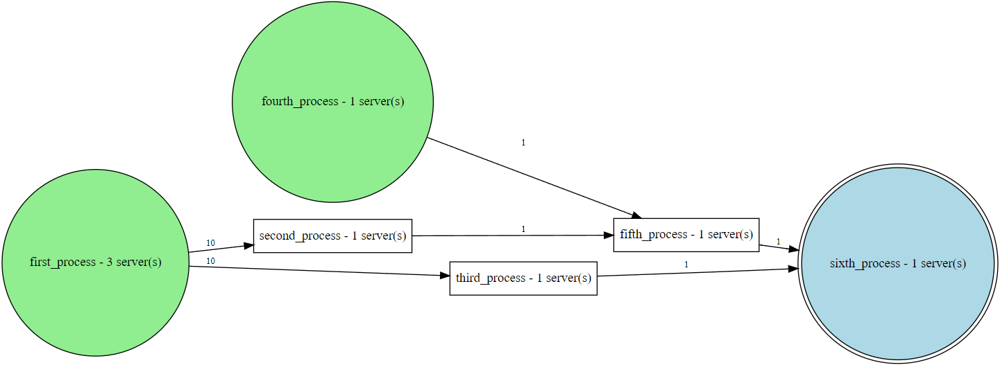

<p align="center">
    <picture>
        <source media="(prefers-color-scheme: dark)" srcset="https://gist.githubusercontent.com/phitterio/66bc7f3674eac01ae646e30ba697a6d7/raw/e96dbba0eb26b20d35e608fefc3984bd87f0010b/DarkPhitterLogo.svg" width="350">
        <source media="(prefers-color-scheme: light)" srcset="https://gist.githubusercontent.com/phitterio/170ce460d7e766545265772525edecf6/raw/71b4867c6e5683455cf1d68bea5bea7eda55ce7d/LightPhitterLogo.svg" width="350">
        
    </picture>
</p>

<p align="center">
    <a href="https://pypi.org/project/phitter" target="_blank">
        
    </a>
    <a href="https://pypi.org/project/phitter" target="_blank">
        
    </a>
    <a href="https://pypi.org/project/phitter" target="_blank">
        
    </a>
    <a href="https://github.com/phitterio/phitter-kernel/actions/workflows/unittest.yml" target="_blank">
        
    </a>
</p>

<p>
    Phitter analyzes datasets and determines the best analytical probability distributions that represent them. Phitter studies over 80 probability distributions, both continuous and discrete, 3 goodness-of-fit tests, and interactive visualizations. For each selected probability distribution, a standard modeling guide is provided along with spreadsheets that detail the methodology for using the chosen distribution in data science, operations research, and artificial intelligence.

    In addition, Phitter offers the capability to perform process simulations, allowing users to graph and observe minimum times for specific observations. It also supports queue simulations with flexibility to configure various parameters, such as the number of servers, maximum population size, system capacity, and different queue disciplines, including First-In-First-Out (FIFO), Last-In-First-Out (LIFO), and priority-based service (PBS).

</p>
<p>
    This repository contains the implementation of the python library and the kernel of <a href="https://phitter.io">Phitter Web</a>
</p>

## Installation

### Requirements

```console
python: >=3.9
```

### PyPI

```console
pip install phitter
```

# Simulation

## Process Simulation

This will help you to understand your processes. To use it, run the following line

```python
from phitter import simulation

# Create a simulation process instance
simulation = simulation.ProcessSimulation()

```

### Add processes to your simulation instance

There are two ways to add processes to your simulation instance:

- Adding a **process _without_ preceding process (new branch)**
- Adding a **process _with_ preceding process (with previous ids)**

#### Process _without_ preceding process (new branch)

```python
# Add a new process without preceding process
simulation.add_process(prob_distribution = "normal", # Probability Distribution
                       parameters = {"mu": 5, "sigma": 2}, # Parameters
                       process_id = "first_process", # Process name
                       number_of_products = 10, # Number of products to be simulated in this stage
                       new_branch=True) # New branch

```

#### Process _with_ preceding process (with previous ids)

```python
# Add a new process with preceding process
simulation.add_process(prob_distribution = "exponential", # Probability Distribution
                       parameters = {"lambda": 4}, # Parameters
                       process_id = "second_process", # Process name
                       previous_ids = ["first_process"]) # Previous Process

```

#### All together and adding some new process

The order in which you add each process **_matters_**. You can add as many processes as you need.

```python
# Add a new process without preceding process
simulation.add_process(prob_distribution = "normal", # Probability Distribution
                       parameters = {"mu": 5, "sigma": 2}, # Parameters
                       process_id = "first_process", # Process name
                       number_of_products = 10, # Number of products to be simulated in this stage
                       new_branch=True) # New branch

# Add a new process with preceding process
simulation.add_process(prob_distribution = "exponential", # Probability Distribution
                       parameters = {"lambda": 4}, # Parameters
                       process_id = "second_process", # Process name
                       previous_ids = ["first_process"]) # Previous Process

# Add a new process with preceding process
simulation.add_process(prob_distribution = "gamma", # Probability Distribution
                       parameters = {"alpha": 15, "beta": 3}, # Parameters
                       process_id = "third_process", # Process name
                       previous_ids = ["first_process"]) # Previous Process

# Add a new process without preceding process
simulation.add_process(prob_distribution = "exponential", # Probability Distribution
                       parameters = {"lambda": 4.3}, # Parameters
                       process_id = "fourth_process", # Process name
                       new_branch=True) # New branch


# Add a new process with preceding process
simulation.add_process(prob_distribution = "beta", # Probability Distribution
                       parameters = {"alpha": 1, "beta": 1, "A": 2, "B": 3}, # Parameters
                       process_id = "fifth_process", # Process name
                       previous_ids = ["second_process", "fourth_process"]) # Previous Process - You can add several previous processes

# Add a new process with preceding process
simulation.add_process(prob_distribution = "normal", # Probability Distribution
                       parameters = {"mu": 15, "sigma": 2}, # Parameters
                       process_id = "sixth_process", # Process name
                       previous_ids = ["third_process", "fifth_process"]) # Previous Process - You can add several previous processes

```

### Visualize your processes

You can visualize your processes to see if what you're trying to simulate is your actual process.

```python
# Graph your process
simulation.process_graph()
```



### Start Simulation

You can simulate and have different simulation time values or you can create a confidence interval for your process

#### Run Simulation

```python
# Graph your process
simulation.run(number_of_simulations = 3) # -> [144.69982028694696, 121.8579230094202, 109.54433760798509]
```

#### Run confidence interval

```python
# Graph your process
simulation.run_confidence_interval(confidence_level = 0.99,
                                   number_of_simulations = 3,
                                   replications = 10)
# -> (111.95874067073376, 114.76076000500356, 117.56277933927336, 3.439965191759079) - Lower bound, average, upper bound and standard deviation
```

## Queue Simulation

If you need to simulate queues run the following code:

```python
from phitter import simulation

# Create a simulation process instance
simulation = simulation.QueueingSimulation(a = "exponential",
                                           a_paramters = {"lambda": 5},
                                           s = "exponential",
                                           s_parameters = {"lambda": 20},
                                           c = 3)

```

In this case we are going to simulate **a** (arrivals) with _exponential distribution_ and **s** (service) as _exponential distribution_ with **c** equals to 3 different servers.

By default Maximum Capacity **k** is _infinity_, total population **n** is _infinity_ and the queue discipline **d** is _FIFO_. As we are not selecting **d** equals to "PBS" we don't have any information to add for **pbs_distribution** nor **pbs_parameters**

### Run the simulation

If you want to have the simulation results

```python
# Run simulation
simulation = simulation.run(simulation_time = 2000)
simulation
# -> df result
```

If you want to see some metrics and probabilities from this simulation you should use::

```python
# Calculate metrics
simulation.metrics_summary()
# -> df result

# Calculate probabilities
number_probability_summary()
# -> df result
```

### Run Confidence Interval for metrics and probabilities

If you want to have a confidence interval for your metrics and probabilities you should run the following line

```python
# Calculate confidence interval for metrics and probabilities
probabilities, metrics = simulation.confidence_interval_metrics(simulation_time = 2000,
                                                                confidence_level = 0.99,
                                                                replications = 10)
probabilities
# -> df result

metrics
# -> df result
```
